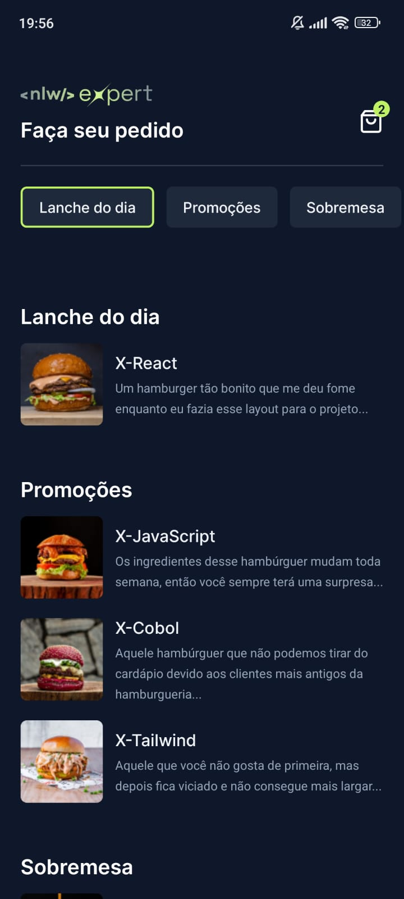

<h1 align="center">
 🚀 NLW_Expert-React-Native 🚀
</h1>

<p align="center">
  
  
  
  
  
  
  
  <br>
  
  
  

  <a href="https://www.linkedin.com/in/t%C3%A1lison-miguel/">
    
  </a>
</p>

---

<p align="center">
  
</p>

---

#  Índice

- :rocket: [Sobre o Projeto](#rocket-sobre-o-projeto)
- 👨‍💻️ [Tecnogias utilizadas](#%EF%B8%8F-tecnogias-utilizadas)
- 📦️ [Como utilizar o projeto](#%EF%B8%8F-como-utilizar-o-projeto)
---

## :rocket: Sobre o Repositório

Um aplicativo móvel de entrega de comida, feito utilizando react native.

---

## 👨‍💻️ Tecnogias utilizadas

✅ [ REACT NATIVE ](https://reactnative.dev/) <br/>
✅ [ TAILWIND ](https://tailwindcss.com/) <br/>
✅ [ Zustand ](https://zustand-demo.pmnd.rs/) <br/>
✅ [ HTML ](https://developer.mozilla.org/pt-BR/docs/Web/HTML) <br/>
✅ [ Clsx ](https://www.npmjs.com/package/clsx) <br/>

###  IDE

  - [ Código do Visual Studio ](https://code.visualstudio.com/)

---

## 📦️ Como utilizar o projeto

Para copiar o projeto, utilize os comandos:

```bash
  ❯ git clone https://github.com/Talison-Miguel/NLW_Expert-React-Native.git
```

---

<h4 align="center">
  Feito com ❤️ por Tálison Miguel 👋️ <a href="mailto:talisonmiguel84@gmail.com">Entre em contato!</a>
</h4>

<p align="center">

  <a href="https://www.linkedin.com/in/talison-miguel/">
    
  </a>
  <a href="https://www.facebook.com/profile.php?id=100009099058734">
    
  </a>
  <a href="https://www.instagram.com/talison_miguel_00/">
    
  </a>
